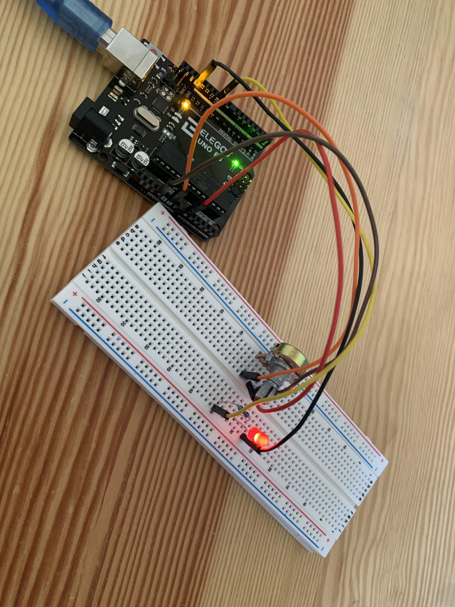

# Midi Controller
 A midi controller is a creative tool that sends and recieves MIDI messages from your device. The knobs, buttons, and sliders can be programmed to do virtually anything desired, making the midi controller unique to the user. Thus, allowing users to expand their imagination and be creative when combining sounds on the controller. 

| **Engineer** | **School** | **Area of Interest** | **Grade** |
|:--:|:--:|:--:|:--:|
| Richard Y | Stuyvesant Highschool | Computer Engineering | Incoming Sophomore

# Links to project components used:

Controller case 
https://www.amazon.com/Otdorpatio-Waterproof-Electrical-11-42x8-27x3-94-290x210x100/dp/B08N1JCYLH/ref=sr_1_10?dchild=1&keywords=plastic+enclosure+for+controller&qid=1628100246&sr=8-10

Push buttons 
https://www.amazon.com/White-Sanwa-Push-Buttons-OBSF-30-W/dp/B003KSB2YC/ref=sr_1_4?dchild=1&keywords=purple+arcade+buttons&qid=1628015080&s=toys-and-games&sr=1-4

Potentiometer with a knob 
https://www.amazon.com/DaFuRui-Terminals-Knurled-Linear-Potentiometer/dp/B07QT1BTLJ/ref=sr_1_1_sspa?dchild=1&keywords=potentiometer+10k&qid=1628101394&sr=8-1-spons&psc=1&spLa=ZW5jcnlwdGVkUXVhbGlmaWVyPUFRWEFLMFE1WVVFQjEmZW5jcnlwdGVkSWQ9QTA2MDc4MTFSRzFBMlMxVjhZVjgmZW5jcnlwdGVkQWRJZD1BMDI3MjE4NDIzVlI0Nkw1RVBMSjAmd2lkZ2V0TmFtZT1zcF9hdGYmYWN0aW9uPWNsaWNrUmVkaXJlY3QmZG9Ob3RMb2dDbGljaz10cnVl

Potentiometer sliders
https://www.amazon.com/DollaTek-Electronic-Building-Potentiometer-Resistance/dp/B07HBWQGYP/ref=sr_1_7?crid=6XE5FMDJDERO&dchild=1&keywords=sliding+potentiometer+10k&qid=1628101760&sprefix=sliding+potentiometer%2Caps%2C232&sr=8-7

Rubber feet
https://www.amazon.com/UOTOO-Laptop-Diameter-Replacement-MacBook/dp/B087774VG5/ref=sr_1_25?dchild=1&keywords=rubber+feet&qid=1628116836&sr=8-25

# Final Milestone
Coming soon.

# Second Milestone
Design Portion coming soon.
  
# First Milestone
My first milestone was setting up the circuit for my potentiometer. I connected 5 wires from the breadboard to the arduino, and set up the led using a resistor and of course inserting the potentiometer. Verifying and uploading the code in my Arduino IDE, I was able to get my led to light up. As I turn the knob to the right, the led will glow brighter and as I turn the knob to the left the led glows darker until no more light is emitted. The hardest part when attempting to set up the potentiometer was getting the wires to its corresponding pin. I had to differentiate between the analog and digital side on my arduino, and be able to identify the ground, input, and power pins on the potentiometer.

 

{:target="_blank" rel="noopener"}
