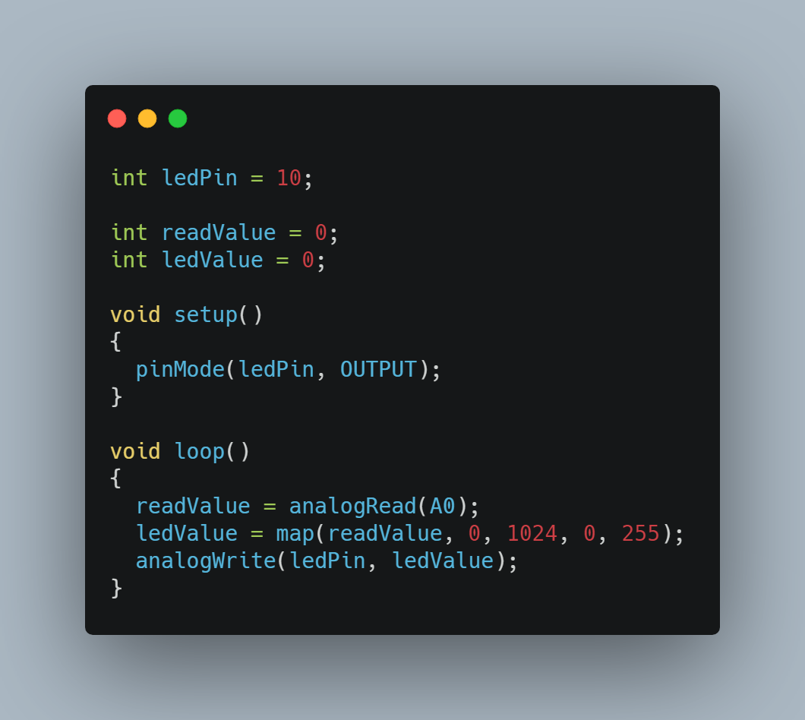

# Midi Controller
During these three weeks, I have been working on a midi controller similar to a musical instrument capable of producing any kind of sound desired. 

| **Engineer** | **School** | **Area of Interest** | **Grade** |
|:--:|:--:|:--:|:--:|
| Richard Y | Stuyvesant Highschool | Computer Engineering | Incoming Sophomore

# Final Milestone
My final milestone is the increased reliability and accuracy of my robot. I ameliorated the sagging and fixed the reliability of the finger. As discussed in my second milestone, the arm sags because of weight. I put in a block of wood at the base to hold up the upper arm; this has reverberating positive effects throughout the arm. I also realized that the forearm was getting disconnected from the elbow servo’s horn because of the weight stress on the joint. Now, I make sure to constantly tighten the screws at that joint. 

{:target="_blank" rel="noopener"}

# Second Milestone
My final milestone is the increased reliability and accuracy of my robot. I ameliorated the sagging and fixed the reliability of the finger. As discussed in my second milestone, the arm sags because of weight. I put in a block of wood at the base to hold up the upper arm; this has reverberating positive effects throughout the arm. I also realized that the forearm was getting disconnected from the elbow servo’s horn because of the weight stress on the joint. Now, I make sure to constantly tighten the screws at that joint.

{:target="_blank" rel="noopener"}
  
# First Milestone
My first milestone was setting up the circuit for my potentiometer. I connected 5 wires from the breadboard to the arduino, and set up the led using a resistor and of course inserting the potentiometer. Verifying and uploading the code in my Arduino IDE, I was able to get my led to light up. As I turn the knob to the right, the led will glow brighter and as I turn the knob to the left the led glows darker until no more light is emitted. The hardest part when attempting to set up the potentiometer was getting the wires to its corresponding pin. I had to differentiate between the analog and digital side on my arduino, and be able to identify the ground, input, and power pins on the potentiometer.

{:target="_blank" rel="noopener"}
